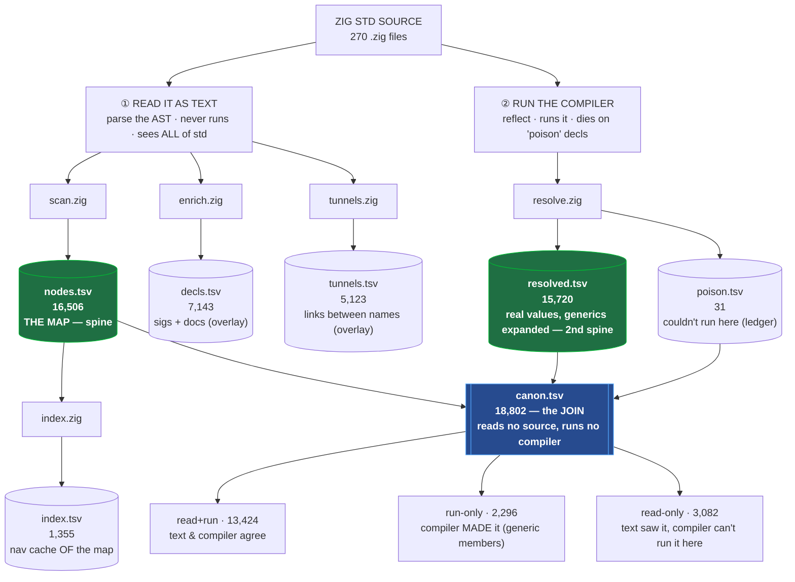

# How the data flows (the whole picture, on one page)

zephem can *feel* like many files rotating over the same thing. They don't. There is **one
source**, read **two ways**, producing **two spines** plus a few overlays, reconciled by **one
join**. Every arrow points one direction — it's a star, not a loop.

## The shape



## Same thing in plain text (if mermaid doesn't render)

```
                          ZIG STD SOURCE  ·  270 .zig files
                                     │
                  the only two ways to learn anything about it
                                     │
            ┌────────────────────────┴────────────────────────┐
     ① READ IT AS TEXT                                 ② RUN THE COMPILER
     parse the AST — never runs it,                    runs it, so it dies on
     so it sees ALL of std                             un-runnable ("poison") decls
            │                                                  │
     ┌──────┼──────────┬───────────┐                          │
     ▼      ▼          ▼           ▼                       resolve.zig
   scan   enrich    tunnels      index                        │
     │      │          │           │                   ┌──────┴──────┐
     ▼      ▼          ▼           ▼                    ▼             ▼
  [nodes] decls    tunnels     index               [resolved]     poison
   16,506  7,143    5,123       1,355                15,720          31
   THE MAP sigs+    links       nav-cache            real values   couldn't
  (spine)  docs     between     OF the map           generics      run here
                    names       (derived)            expanded
           (overlays, keyed to the map by `path`)    (2nd spine)
           │                                                │
           └──────── two spines + poison meet in ───────────┘
                          exactly ONE place
                                  ▼
                            [ canon.tsv ]  18,802   ← a JOIN, not a new reader
                                  │
                  ┌───────────────┼────────────────┐
                  ▼               ▼                 ▼
              read+run        run-only          read-only
              13,424          2,296             3,082
              both agree      compiler made it  text-only / poison
```

## How to read it

- **Two readers, two spines.** `scan.zig` reads the *text* → `nodes.tsv` (the map). `resolve.zig`
  *runs the compiler* → `resolved.tsv` (resolved values). Everything else hangs off these two.
- **Overlays are extra facts on the same spine**, keyed by `path` so they join cleanly: `decls`
  (signatures/docs), `tunnels` (link edges), `index` (a navigation cache derived from the map).
  They are *not* re-collections of the map — each is a different fact.
- **`canon.tsv` is a view, not a collector.** It opens `nodes` + `resolved` + `poison` and labels
  every name by which reader can see it. It reads no `.zig` and runs no compiler.

## "Are we rotating over the same data?" — the honest answer

No circle exists in the data — every arrow points down. The repetition you can *feel* is real but
lives in two specific places, and neither is the data model:

1. **The source is parsed three times** (scan / enrich / tunnels) — but for three *different* facts
   (structure / signatures / link-edges). Same book, three different questions.
2. **Many checks reconcile the same two spines** (`verify_*` + `canon`). These are *verifications*,
   not new data — they prove the pile agrees with itself. That's where it feels circular.

So the surface area is in the number of **checks**, not in the flow. If we wanted to shrink it, the
one real redundancy is that `verify_layers.nu`'s coverage-delta section now overlaps `canon.tsv`
(canon *persists* the classification verify_layers computed on the fly) — that section can be
retired and pointed at canon.
