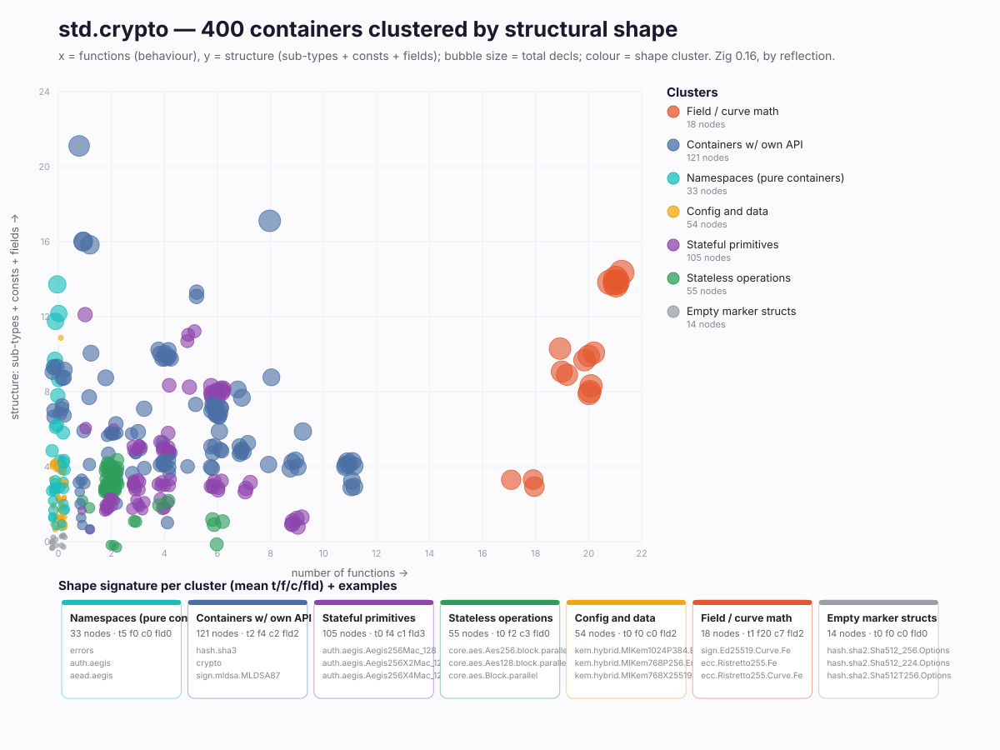

# std.crypto shape clusters

Every one of the 400 mapped containers, grouped by its structural **count-signature** `(sub-types, functions, consts, fields)` using the explicit rules below (first match wins). No semantic guessing — pure shape.



> If the image doesn't render inline, open **`docs/clusters.svg`** directly.

## Rules

```
f>=13                                  -> math      (field/curve arithmetic)
types>=1 & f==0 & c==0 & fld==0        -> namespace (pure container of types)
types>=1                               -> scheme    (container + its own api/consts)
f==0 & (fld>=1 | enum)                 -> config    (options, enums, results)
fld>=1 & f>=1                          -> stateful  (state + methods)
fld==0 & f>=1                          -> ops       (methods, no state)
else                                   -> other     (empty marker structs)
```

## Counts

| cluster | nodes |
|---|---|
| Containers w/ own API | 121 |
| Stateful primitives | 105 |
| Stateless operations | 55 |
| Config and data | 54 |
| Namespaces (pure containers) | 33 |
| Field / curve math | 18 |
| Empty marker structs | 14 |

*Generated by `scripts/cluster_shapes.nu` from `data/crypto_tree.tsv` (Zig 0.16, 2026-06-17). Cluster assignments in `data/clusters.tsv`.*